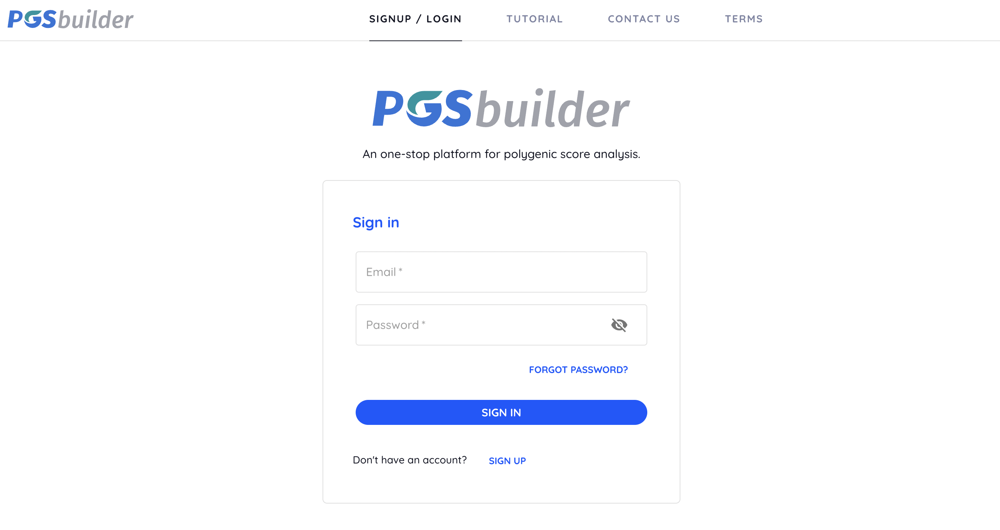

# PGSbuilder

PGSbuilder is a web server for the genome-wide association study (GWAS) and polygenic risk score (PRS) analysis of human genomes with variant annotations. Users can upload genotyping data in PLINK bfile or tfile format and get GWAS results and PRS models from six different algorithms.

The Source code is hosted on [GitHub](https://github.com/ailabstw/PGSbuilder)