# Interpreting the Result

After the job is completed, users can both download and view the result on the PGSBuilder. In the main page of the job result, all customized settings are listed, including general, GWAS, and PRS settings.
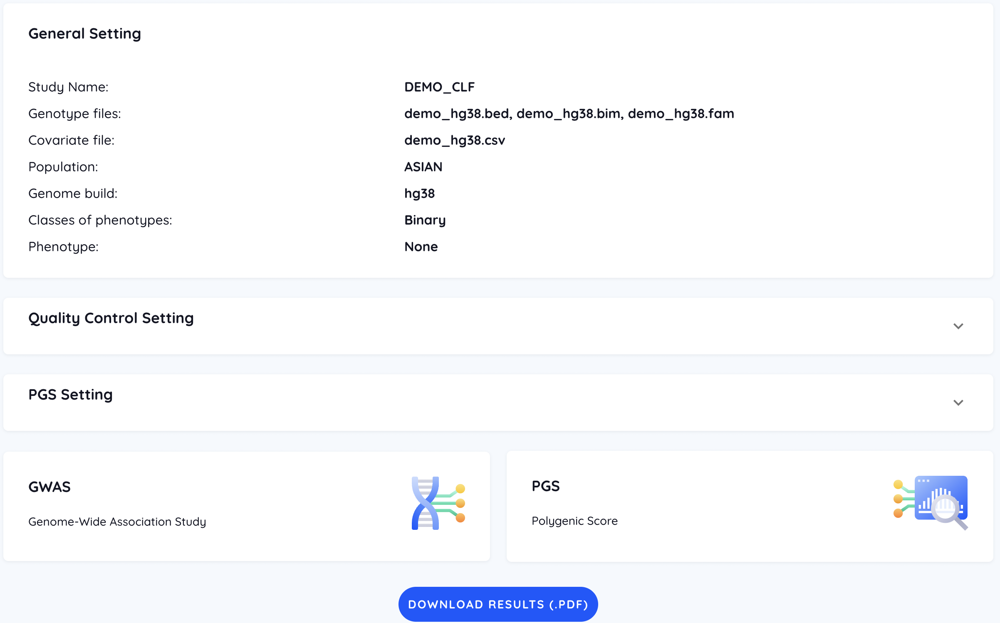

## GWAS
### QC
The QC result is only reported in the downloaded result (.pdf).

### PCA
The paired distributions of the top 3 PCs are shown interactively. Users can switch between three figures through the arrow button. In addition, each dot represents a sample whose ID will be displayed via a mouseover event, which can help users discriminate outliers.

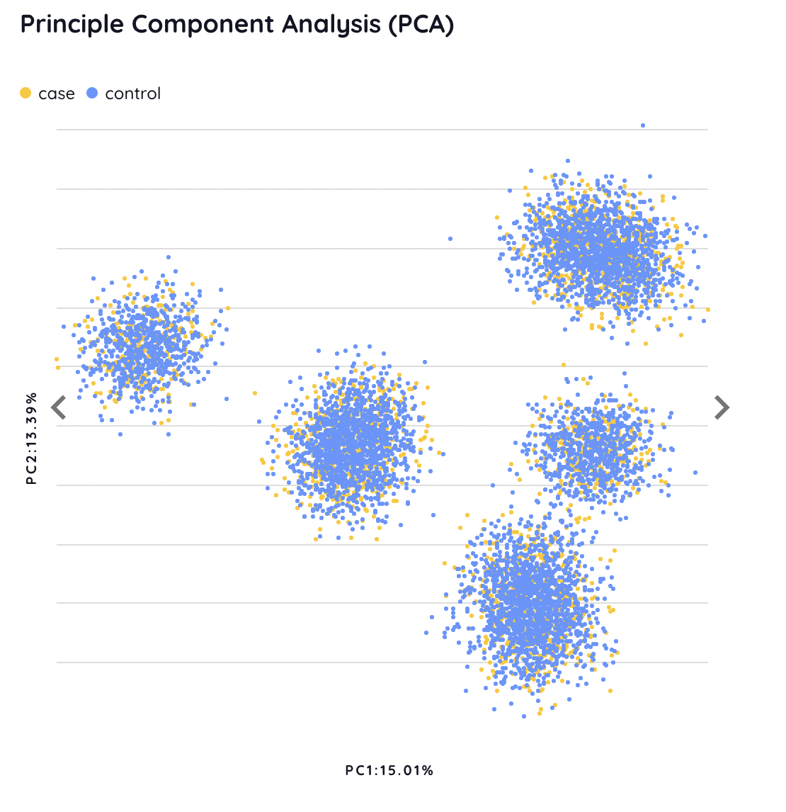
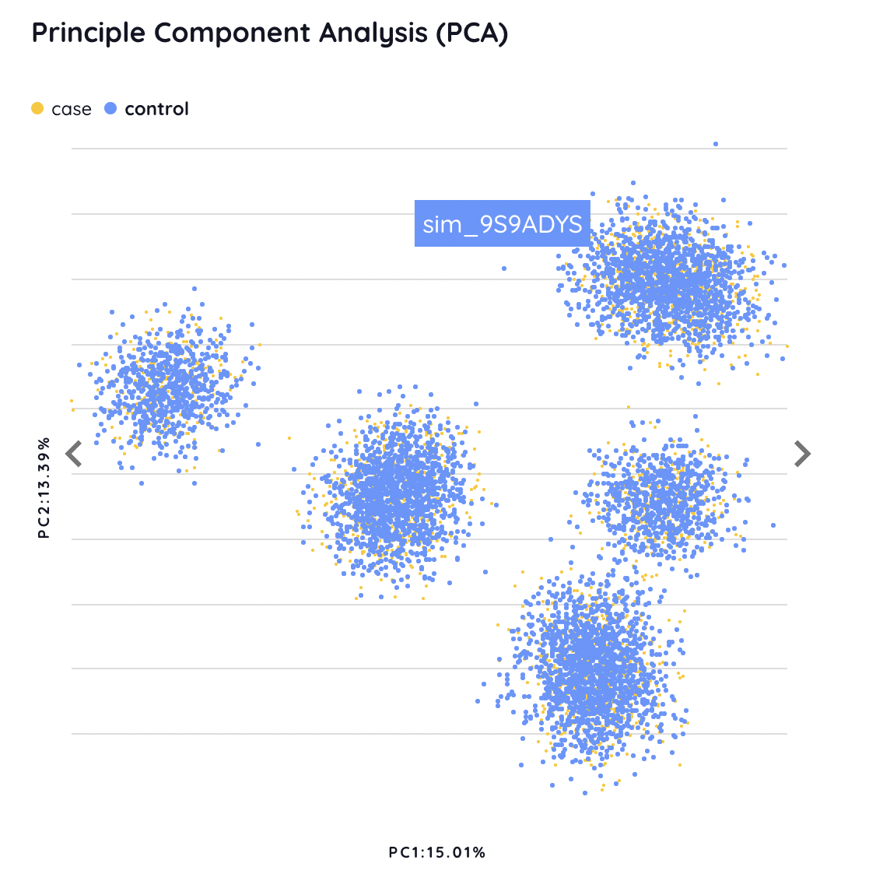

### Q-Q plot
The Q-Q plot is provided to evaluate the deviation of observed P-values from expected P-values under a uniform distribution.
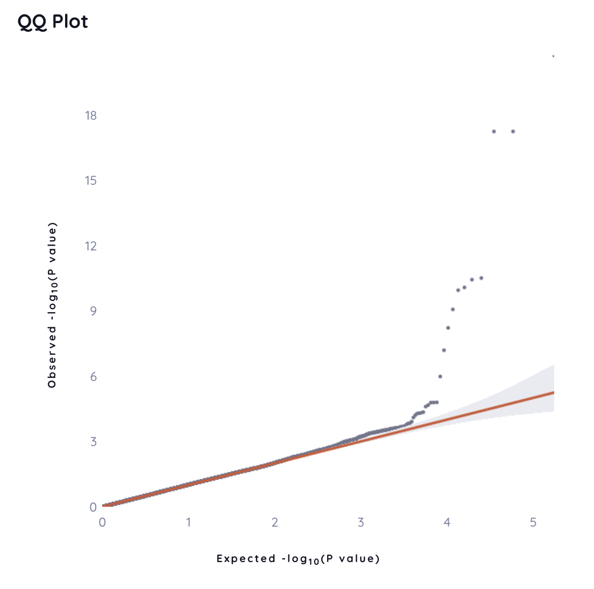

### Manhattan plot
The Manhattan plot shows the scatter plot of P-value and position for each SNP. We set a suggestive P-value threshold of 1×10-5 and a strict P-value threshold of 5×10-8. SNPs with a P-value smaller than the threshold are colored in orange and listed in the variant table.

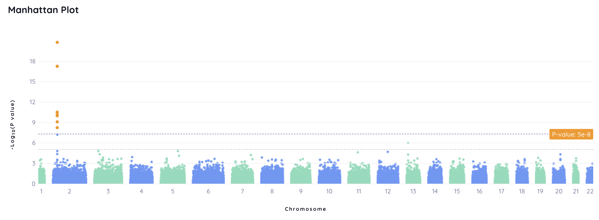

### Variant table
The variant table shows all significant SNPs. The detail of annotation for each SNP is referred to [Annotation](#annotation)

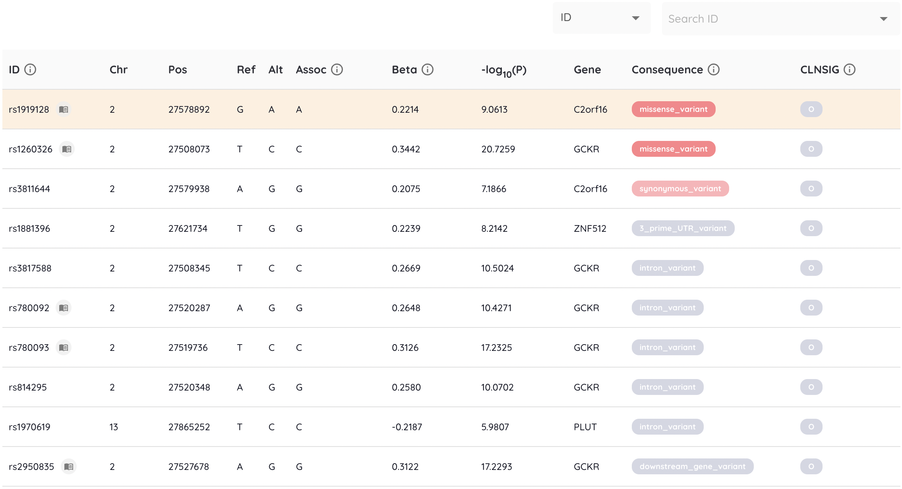

The SNPs in the Manhattan plot and the variant table are interactive. Clicking on an orange point on the Manhattan plot navigates the variant table to the corresponding SNP with its information, and vice versa. Besides, users can search for a specific SNP through the search bar.

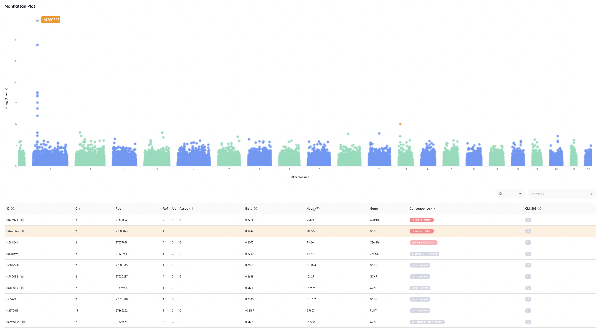

## PRS
In the PRS analysis, different performance matrics are used depending on the binary or quantitative traits. Additionally, users can click the tab to view the performance of a specific method. To get the perofrmance of all methods in a single figure, users can downlaod them from the bottom of the page.

### Quantile plot
The quantile plot shows the risk stratification. For each algorithm, samples in the test set are divided into 10 quantiles of increasing PRS. 

For a binary trait, the odds ratio is calcuated in each quantile. Of note, all individuals in the test set serve as the baseline for odds ratio calculation for binary tracts.
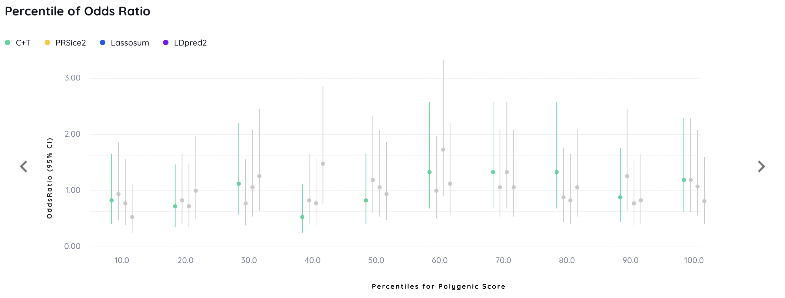

For a quantitative trait, the mean of values is calculated in each quantile.

### Performance
For a binary trait, the ROC curve and distribution plot for each model with or without covariates are demonstrated.
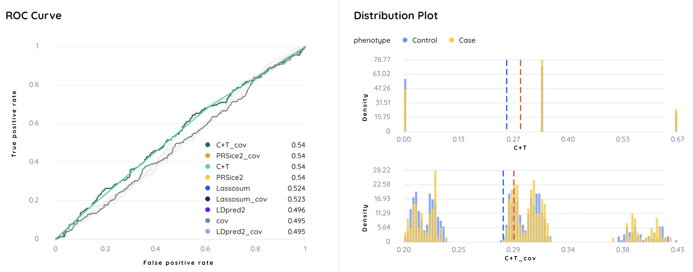

For a quantitative trait, the Spearman correlation and scatter plots are shown.
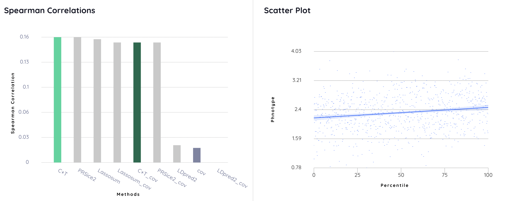

### Covariate table
A covariate weight table lists the weight for each provided covariate in the PRS+covariate model.
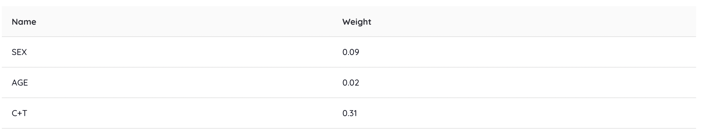

### Variant table
A variant table similar with the one in GWAS result is used to provide annotated information of the SNPs with top-100 weights. It lists the weight of each SNP, which can be used to compare the importance in different models.
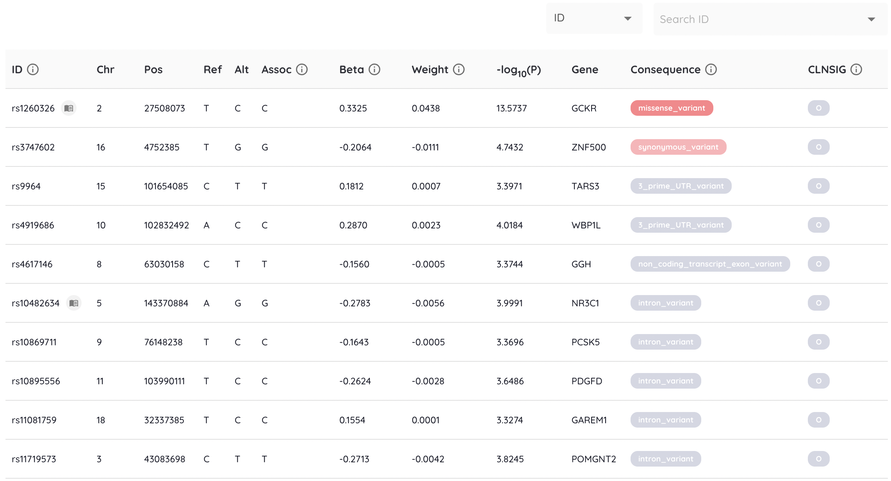

## Annotation
To facilitate the functional analysis, we provide a variant table in both GWAS and PRS results. For each SNP, we provide four different levels of annotation.
1. SNP information: the coordinate of the SNP
2. [VEP](https://doi.org/10.1186/s13059-016-0974-4) annotation
   - Gene name
   - Transcript name
   - Ensembl: biotype and consequence ([Ref.](https://m.ensembl.org/info/genome/variation/prediction/predicted_data.html))
   - ClinVar: CLNSIG and CLNREVSTAT ([Ref.](https://www.ncbi.nlm.nih.gov/clinvar/docs/clinsig/))
   - Allele frequency: Taiwan Biobank and 1000 Genome
3. External websites
   - dbSNP
   - gnomAD
   - GWAS Catalog
   - NCBI Gene
   - GeneCards
4. [pubmedKB](https://doi.org/10.1093/nar/gkac310): the literature mining results

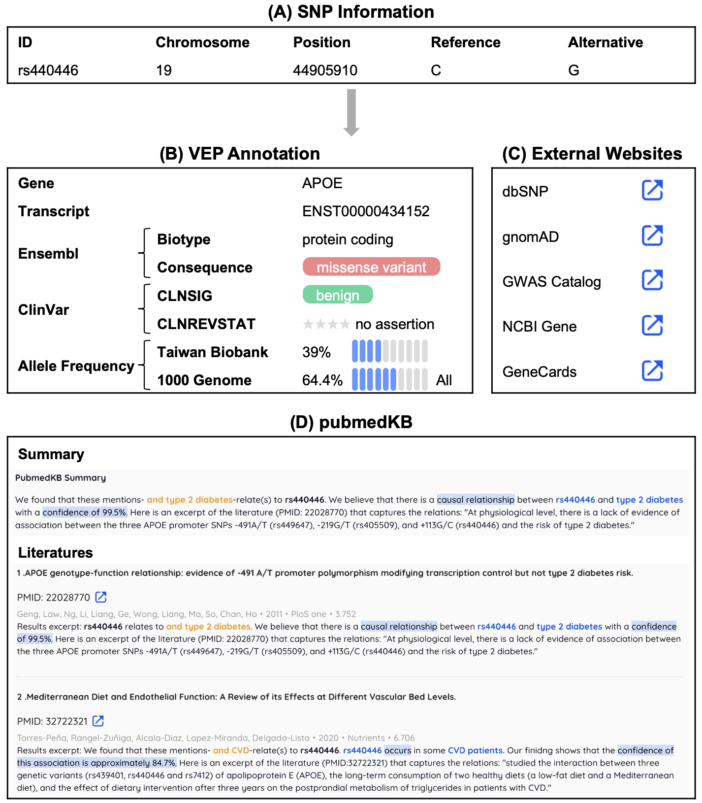

This table is sorted according to several annotation information including transcript consensus, mutation consequence, mutation severity, and feature biotype.