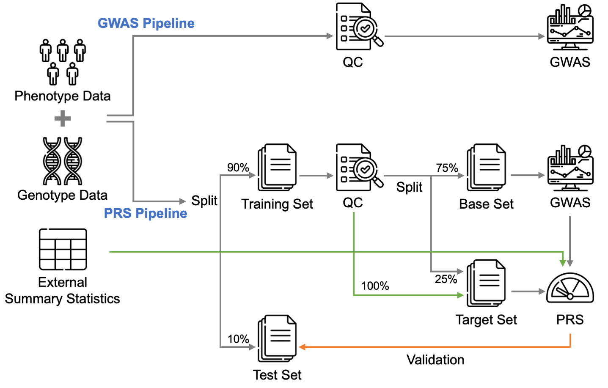

# Pipeline Overview

PGSBuilder performs both GWAS and PRS in a single run. The GWAS pipeline, which is applied to the whole input dataset, consists of quality control (QC) and association tests. As for the PRS pipeline, the input dataset is split into base, target, and test sets. Summary statistics are calculated from the base set, and then PRS models are built from the base and target sets. Finally, the test set is used to evaluate the performance of the PRS model.

## GWAS Pipeline
### Quality control
Most of the QC criteria and recommended thresholds are referred to [Marees et al](https://doi.org/10.1002/mpr.1608).
1. SNP QC: Filter out unqualified SNPs according to minor allele frequency, Hardy-Weinberg equilibrium, and missingness
2. Individual QC: Filter out unqualified individuals according to missingness, heterozygosity rate, and kinship coefficient
3. Population stratification: Stratify population using HapMap as the reference panel and remove outliers

### Association test
1. PCA: Perform PCA and select top 10 principal components (PCs) for correcting the genetic difference between individuals
2. Covariates: Combine top 10 PCs with provided covariates to control the covariates effect in the association test
3. Association test: Conduct association test on each autosomal SNP

## PRS Pipeline
1. Data split: Split the raw data into training and test sets
2. Quality Control: Conduct QC on the training set with the same setting as GWAS
3. Data split: Split the post-QC training set into base and target sets
4. Association test: Perform association test on the base set
5. PRS model: Build PRS models with the base and target sets. Of note, we only train the GenEpi model on the base set
1. Validation: Validate the PRS models on the test set