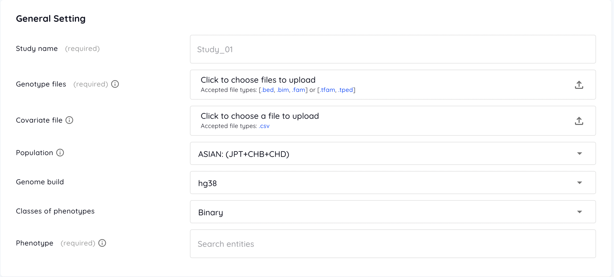
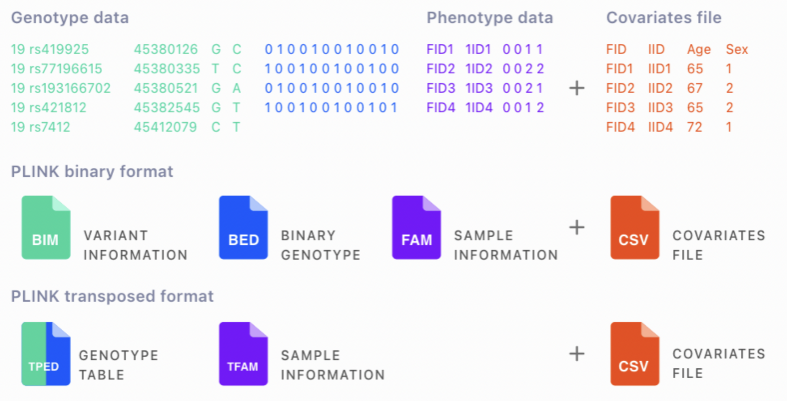
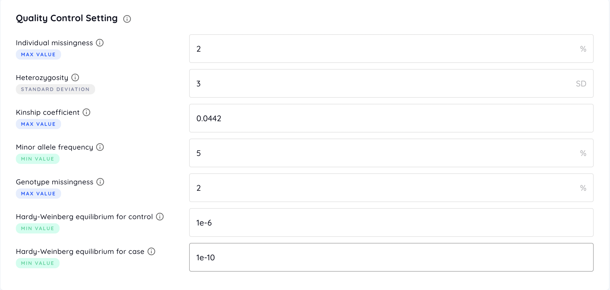
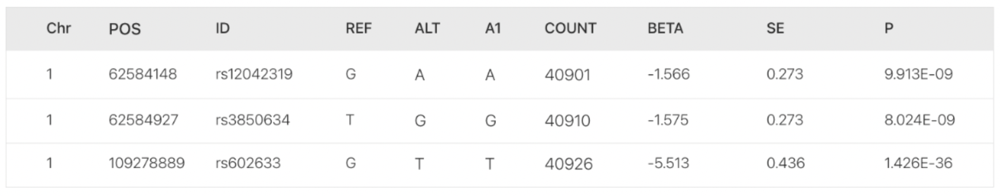

# Submitting a Job

Signing up with your email is required for the security of private genomics data. After you sign up, an activation link will be sent to your email. Then, you can log in with this activated account to submit your GWAS and PRS study for free.

After you login your account, click the **NEW STUDY** button to create a study.

## General Setting

### Genotype files
The genotype file should be the PLINK binary or transposed format. The PLINK binary format is composed of a variant information file (.bim), a binary genotype file (.bed), and a sample information file (.fam), while the PLINK transposed format is composed of a genotype table (.tped) and a sample information file (.tfam).

### Covariate files
The covariate file is a .csv file with FID and IID consistent with the genotype file as well as several covariate columns following the rules below:

- For continuous variables like AGE, please provide finite numeric values.

- For binary discrete variables like SEX, please use 1 and 2 as binary values. Note that 0 or -9 will be treated as missing values.

- For multi-class discrete variables, please provide string, such as "A", "B", "O", "AB". It will be encoded as a one-hot numeric array.

- Missing values should be specified as NaN or empty ("").

In avoidance of error analysis, the covariate file will be checked according to the following rules:

- VIF (Variance inflation factor) of each variable should be less than 50.

- Missing rate of each variable should be less than 20%.

- For multi-class variables, the number of categories should be less than 0.25*individual number.

- Correlation coefficient of any variable pairs should be less than 0.999.

### Population
Select a population of the cohort for the population stratification and the calculation of linkage disequilibrium blocks. We use the HapMap3 as our reference for population stratification, so all the populations in the HapMap3 are available.

### Genome build
Select the reference genome version of your input data, hg19 or hg38.

### Classes of phenotypes
Select the type of the target phenotype, binary or quantitative.

### Phenotype
Select the term mostly related to the target phenotype. In the following analysis, this term will be used to search articles for the relation between the phenotype and SNPs using PubmedKB.

## Quality Control Setting

### Individual missingness
Filters out individuals with missing rate of SNPs exceeding the provided value (default = 2 %).

### Heterozygosity
Filters out individuals deviating the provided value of standard deviation (SD) from the samples’ mean heterozygosity rate (default = 3 SD).

### Kinship coefficient
Represents the degree of relation between a pair of individuals. Coefficient ranges of [0.177, 0.354], [0.0884, 0.177], [0.0442, 0.0884] correspond to 1st-degree, 2nd-degree, and 3rd-degree relationships respectively. Individuals with the coefficient with any other individuals exceeding the provided value are filtered out (default = 0.0442). Please refer to [KING tutorial](https://www.kingrelatedness.com/manual.shtml) for more information.

### Minor allele frequency
Filters out SNPs with minor allele frequency below the provided value (default = 5 %).

### Genotype missingness
Filters out SNPs with missing rate over the dataset exceeding the provided value (default = 2 %).

### Hardy-Weinberg equilibrium
Filters out SNPs with test P-value for HWE below the provided value (default = 1e-6). For binary phenotype, different criteria for cases and controls are available (default = 1e-10 for cases and 1e-6 for controls).

## PGS Setting
### External summary statistics file
An external summary statistics file is optional. If uploaded, it will be served as the base dataset providing effect sizes of SNPs. Therefore, the uploaded genotype data will be only separated into target and test datasets to build and evaluate the PRS model respectively.

An external summary statistics file in .tsv format may contain the following columns:

- Required columns

    - Chromosome: Only autosomal variants are used. Values must be pure numbers, e.g. 1 and 2, which means “chr1” is not allowed.

    - Position: Values must be pure numbers.

    - SNP ID: The ID system of the genotype data and the external summary statistics file has to be the same, e.g. rsID, because some PRS algorithms use ID to match SNPs between these two provided files.

    - Reference allele

    - Alternate allele

    - Effect allele: The counted allele in the association test.

    - Number of samples: Each SNP may have different number of samples in the association test.

    - Beta / OR: The effect size of SNPs to measure the strength of the association. Only one of Beta (coefficient) or OR (odds ratio) is needed.

    - Standard error of beta (i.e. log-odds)

    - P-value / -log10(P): P-value or -log10(P-value) for T / Chi-squared test.

- Optional columns

    - Non-effect allele: The opposite allele of the effect allele.

    - A1-frequency: The allele frequency of the effect allele.

Table of the acceptable name of columns

| Column | Acceptable column names (ignoring the upper and lower case) |
| --- | --- |
| Chromosome | CHR, CHROM, #CHROM, CHROMOSOME |
| Position | POS, POSITION, BP |
| SNP ID | ID, SNP, RSID |
| Reference allele | REF |
| Alternative allele | ALT |
| Effect allele | A1, ALLELE1, ALLELE_1 |
| Non-effect allele | A2, AX, A0, ALLELE0, ALLELE_0, ALLELE2, ALLELE_2 |
| A1-frequency | AF, A1_FREQ, A1FREQ, FREQUENCY, ALLELE_FREQ, ALLELE_FREQUENCY |
| Number of samples | COUNT, N_EFF, NEFF, NUMBER, OBS_CT |
| Beta | BETA |
| Odds ratio | OR |
| Standard error of beta | BETA_SE, SE, LOG(OR)_SE |
| Statistic score | STAT, T_STAT, Z_STAT |
| P-value | P |
| -log10(P) | LOG_P, LOGP, LOG10_P, LOG10P |

An example of the summary statistics file (.tsv)

### PGS methods
Six methods of PGS are available, including:

- [Clumping and thresholding (C+T)](https://doi.org/10.1038/nature08185): The classical algorithm that adjusts the LD using clumping and selects SNPs with P-value less than a specified threshold to calculate the PRS for each individual

- [PRSice2](https://doi.org/10.1093/gigascience/giz082): A clumping and thresholding-based PRS algorithm with a higher resolution of thresholds

- [Lassosum](https://doi.org/10.1002/gepi.22050): Utilizing penalized regression to adjust the effect size of SNPs for a PRS model.

- [LDpred2](https://doi.org/10.1093/bioinformatics/btaa1029): A Bayesian PRS predictor by adjusting the effect size of SNPs from the summary statistics

- [PRScs](https://doi.org/10.1038/s41467-019-09718-5): A Bayesian polygenic prediction method that infers the posterior effect size of SNPs from the summary statistics using continuous shrinkage priors

- [GenEpi](https://doi.org/10.1186/s12859-020-3368-2): A machine learning-based method taking both additive effect and SNP-SNP interactions into consideration to build a PRS model from the raw genomic data

### Data splitting method
Select the method for splitting data into base, target, and test sets. If external summary statistics is provided, the input dataset will be split into target and test sets. The external summary statistics is served as the base set providing pre-adjusted effect sizes of SNPs. On the other hand, without external summary statistics, the input dataset will be split into three sets, including base, target, and test sets.

Users can split their input data randomly or according to the provided list. Under the random split, the ratio of test set is an optional argument (default: 10%), and then the other samples will be split into base and target set with the ratio of 3:1. To split the input data specially, users should provide a test list, and the base and target lists are optional. If the base and target lists are not provided, non-test samples will be split with the ratio of 3:1. Of note, the base and target lists have to be provided or not simultaneously.

There are two columns with no header in lists. The first is FID and the other is IID, tab-deliminated. Please make sure all ID can be matched in fam file. We use plink2 --keep and --remove command to split the dataset. Error will be raised if less than 10 samples are found in a split dataset.

The following is the example of sample list (only .tsv files are allowed):

sim_000HDES&emsp;sim_000HDES

sim_001SEVR&emsp;sim_001SEVR

sim_002RI30&emsp;sim_002RI30

sim_003P97B&emsp;sim_003P97B

sim_003RGCQ&emsp;sim_003RGCQ

sim_005DYBW&emsp;sim_005DYBW

sim_006BDZD&emsp;sim_006BDZD

### Percentage for testing data
Separates the dataset into training and testing set for PRS analysis according to the provided testing ratio (default = 10 %). During the PRS analysis, the training set will be further separated into base and target set with the ratio of 3:1. Base set is used for the association test, and target set is used for linkage disequilibrium calculation.